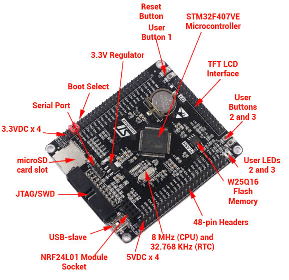

# FYP18-03

Firmware for a final year project.

## About

Developed for an STM32F407VET6 board 



with a 320x240 LCD(ILI9341) connected to its FSMC interface.

### Graphics

The GUI is developed using LVGL library.

### Firmware

The firmware is developed on Mbed platform. 


## Getting started 

### Requirement

A linux system(even WSL) with python and ARM toolchain and [```mbed-tools```](https://os.mbed.com/docs/mbed-os/v6.15/build-tools/mbed-cli-2.html) installed.

### Deployment

Using ```mbedcli2``` tool, run the following commands to deploy and build the project.
```bash
mbed-tools deploy .  # to deploy 
mbed-tools configure -m STM32F407VE_BLACK -t GCC_ARM # to configure
mbed-tools compile -m STM32F407VE_BLACK -t GCC_ARM # to  build
```

### Ethernet
This application supports ethernet communication between the PC and the Black_f407ve board. 
It is achieved through [EmbeddedProto](https://github.com/Embedded-AMS/EmbeddedProto). This is added to the main application
as a submodule, and a header file representing a proto file is generated using the following procedure

* Install the latest version of protobuf by downloading a prebuilt binary from [protobuf official repo](https://github.com/protocolbuffers/protobuf/releases).
* Extract it in your path of choice e.g```~/protobuf/protoc-21.6/```
* Run the EmbeddedProto setup script in its parent directory.
```bash
cd EmbeddedProto && python setup.py --include ~/protobuf/protoc-21.6/include
```
* Generated the source of your proto file using the following
```bash
source venv/bin/activate &&
protoc --plugin=protoc-gen-eams  -I../proto  --eams_out=../generated_src  ../proto/eth_messages.proto 
```
* The generated header file will be stored in the ```generated_src``` directory.
### Flashing

The generated binary image is located in build directory. Flash the image using the following command

```bash
st-flash <binary name>.bin 0x8000000  # requires stlink installed 
```